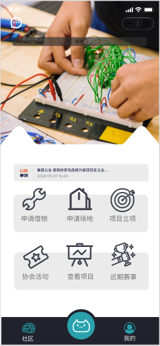

**限制**：根据微信官方的规定，小程序的总文件大小不得超过10MB，其中代码部分不得超过1MB，图片、音频等资源文件不得超过2MB。此外，小程序的总代码行数也不得超过5000行。开发者必须在这些限制范围内完成小程序的开发和发布。

## 设计预览

请到即时设计查看UI：https://js.design/f/PHtLZA?p=ADeQDo4oe4&mode=design


## 1. **小程序轻量化设计与实现**

### 1.1 **分离前端与后端**
- **小程序的主要职责**：只负责页面展示和用户交互，将复杂的逻辑与数据操作交由后端处理。
- **后端的主要职责**：提供接口（RESTful 或 GraphQL），响应前端的请求，处理业务逻辑，并与数据库交互。

### 1.2 **使用微信API实现轻量化**
- **微信登录**：使用 [wx.login](https://developers.weixin.qq.com/miniprogram/dev/api/open-api/login/wx.login.html) 获取用户 `code`，然后发送到后端进行验证和用户信息存储。
- **静态资源优化**：
  - 使用 CDN 存储图片和视频，减少小程序包的体积。
  - 动态加载内容（如新闻和帖子），不要在小程序包内包含大量数据。
- **模块化加载**：仅加载用户有权限访问的模块页面。例如：
  - 未认证用户只能访问某些模块，则其他模块的资源可以不加载，减少流量和包体积。

---

## 2. **后端功能设计与实现**
 
后端可以使用现代的框架（如 `Node.js` + `Express`，`Django`，`Spring Boot` 等）部署在服务器上，并通过 API 提供功能支持。

### 2.1 **功能模块设计**
| 模块 | 描述 | API 示例 |
|------|------|----------|
| 用户管理 | 区分认证用户与访客，并存储角色信息。 | `/api/auth/login` `/api/auth/register` |
| 门禁控制 | 控制智能锁的开关。 | `/api/door/open` `/api/door/close` |
| 新闻与信息 | 获取和管理社团宣传内容。 | `/api/news/list` `/api/news/{id}` |
| 比赛组队 | 创建队伍、申请加入。 | `/api/teams/create` `/api/teams/join` |
| 借物管理 | 登记借用、查看物品状态。 | `/api/items/borrow` `/api/items/return` |
| 活动报名 | 获取活动列表、报名接口。 | `/api/events/list` `/api/events/signup` |
| 交流平台 | 类似贴吧的功能。 | `/api/posts/create` `/api/posts/list` |
| 社团荣誉 | 展示社团的获奖情况。 | `/api/honors/list` |

### 2.2 **用户权限管理**
使用**角色管理系统**来区分认证用户与访客：
- **数据库表结构**：
  - `users` 表存储用户基本信息（id, openid, role）。
  - `roles` 表定义权限（e.g., `MEMBER`, `GUEST`）。
  - `role_permissions` 表将角色与具体模块功能绑定。
- **权限校验流程**：
  - 用户通过登录后获得 Token。
  - Token 中包含角色信息，前端调用 API 时附加该 Token。
  - 后端通过中间件检查角色权限，限制访问。

### 2.3 **数据存储与结构**
使用关系型数据库（如 MySQL）或非关系型数据库（如 MongoDB）：
- **用户信息**：`users` 表存储用户、角色信息。
- **动态内容**：`news`, `posts`, `events` 表存储内容信息。
- **权限关联**：`role_permissions` 表存储角色和功能的映射。

---

## 3. **多人协作与代码管理**

### 3.1 **使用 Git 仓库**
1. **仓库结构建议**：
    ```
    project-root/
    ├── frontend/      # 小程序代码
    ├── backend/       # 后端代码
    ├── docs/          # 文档
    └── scripts/       # 开发辅助脚本
    ```

2. **多人协作流程**：
    - 使用 `main` 分支作为主分支，仅合并稳定代码。
    - 每个功能模块（如门禁、活动报名）使用单独的功能分支（`feature/功能名`）。
    - 使用 Pull Request 提交代码，由其他人进行 Code Review 后合并。

3. **分支管理示例**：
    - **`main` 分支**：发布生产环境代码。
    - **`develop` 分支**：开发环境代码。
    - **`feature/xxx` 分支**：单独功能分支。
    - **`hotfix/xxx` 分支**：快速修复问题的分支。

### 3.2 **后期维护与文档管理**
- **版本控制**：使用 Git 的 Tag 功能标记版本。
- **自动化部署**：配置 CI/CD 工具（如 GitHub Actions, Jenkins），在代码合并到 `main` 分支后自动部署到服务器。
- **文档管理**：
  - 使用 Markdown 编写接口文档、部署说明、使用说明等。**//workplace**
  - 将文档存放在 `docs/` 文件夹中。

---

## 4. **认证用户与外来人员的逻辑**
1. **认证流程**：
   - 用户初次登录后，默认角色为访客。
   - 用户需要提交申请认证。
   - 管理员审核后，将用户角色改为协会成员。
   
2. **用户权限区分**：
   - 在前端，基于用户角色动态显示功能模块。
   - 在后端，拦截未经授权的请求。

